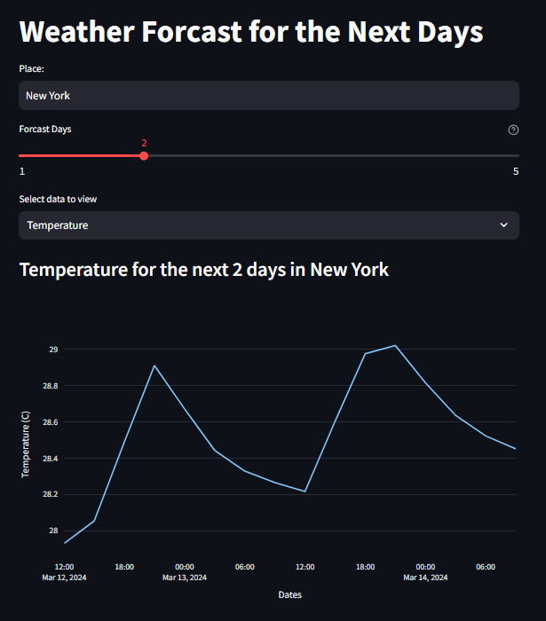
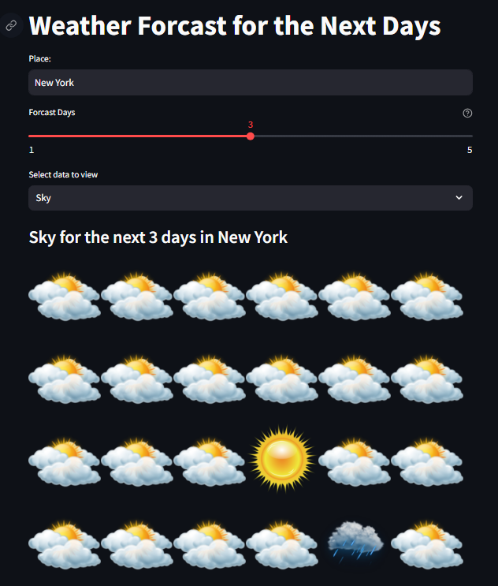

# Weather Forecast App

Welcome to the Weather Forecast App! This application provides weather forecast data for the next few days based on the location you input.

## Features
- **Dynamic Weather Data**: Get real-time weather forecast data for any location.
- **Customizable Forecast**: Choose the number of days to forecast and the weather parameter to view.
- **Interactive Visualization**: View temperature trends and sky conditions using interactive plots and images.

## Installation
1. Clone the repository to your local machine.
2. Install the required dependencies using `pip install -r requirements.txt`.

## Usage
1. Run the `main.py` file.
2. Enter the desired location and select the number of forecast days and data type (Temperature/Sky).
3. View the weather forecast data displayed in an interactive plot or image.

## Technologies Used
- Python
- Streamlit
- Plotly Express

## Screenshots

## Contributing
Contributions are welcome! If you have any ideas for improvements or new features, feel free to open an issue or submit a pull request.

## Credits
- Developed by [Supun Wickramarachchi](https://github.com/supunwickramarachchi).
- Weather data provided by [OpenWeather](https://openweathermap.org/).

Enjoy using the Weather Forecast App to stay informed about the weather in your area!
